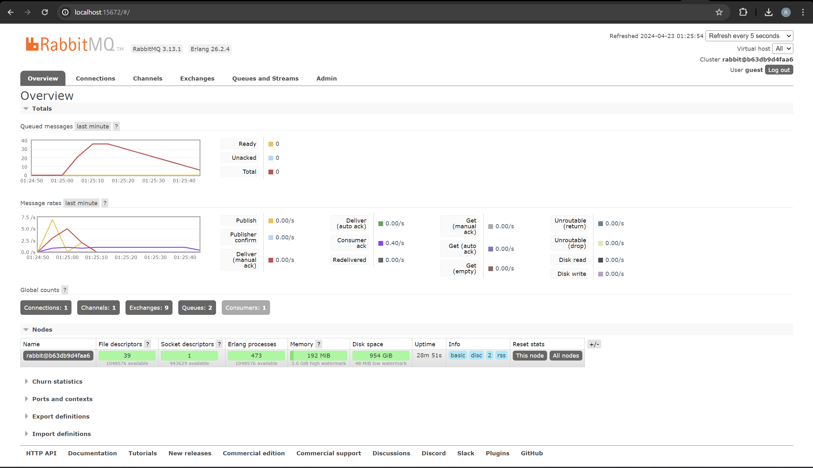
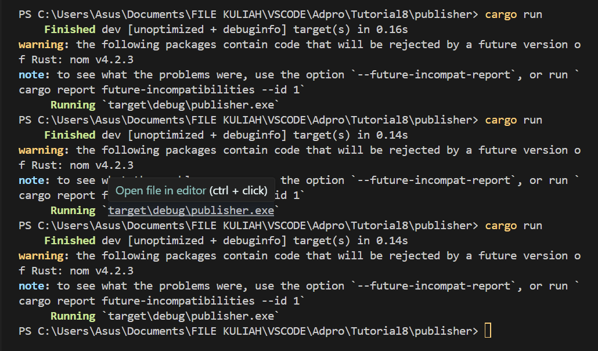
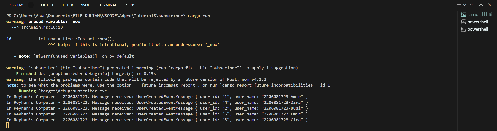
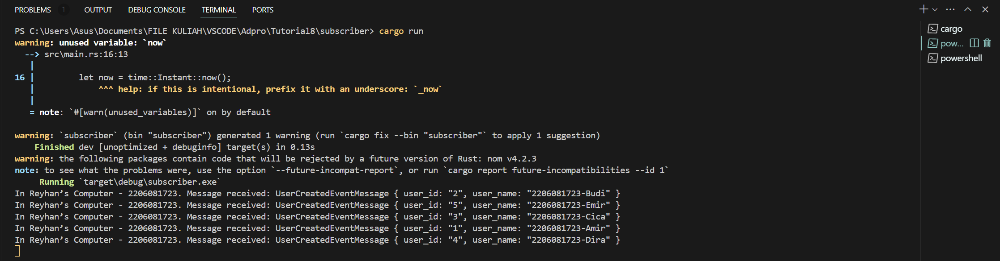
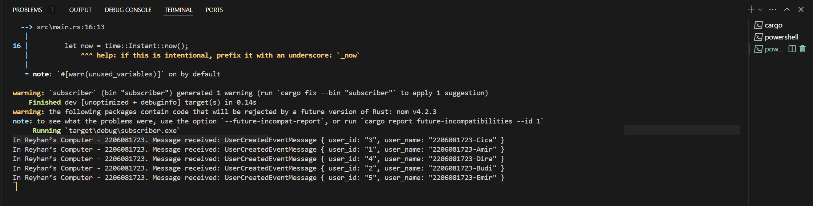
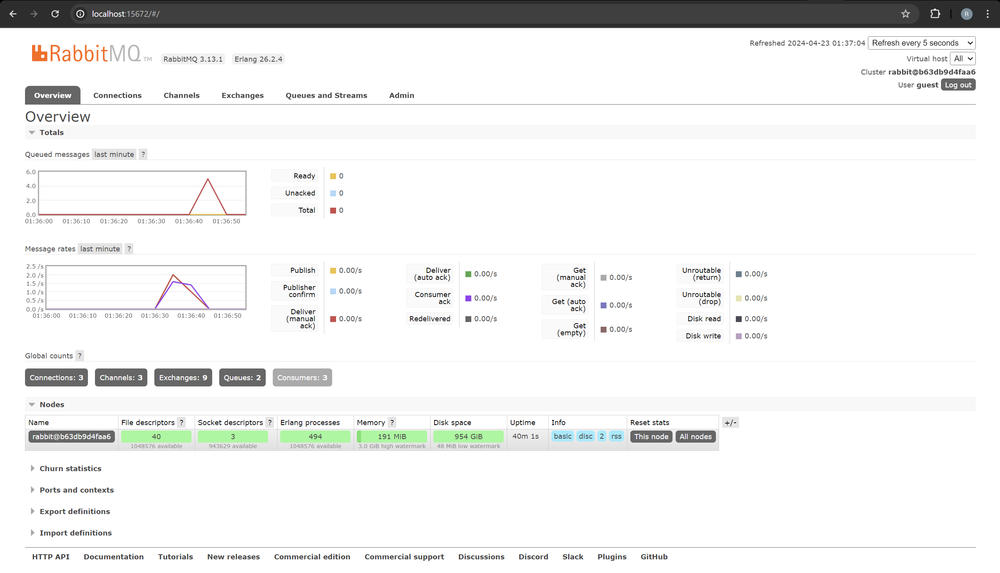

## Reyhan Zada Virgiwibowo
## 2206081723
## Advanced Programming - C
## Modul 8 - Subscriber

## a. What is ampq?

AMQP adalah singkatan dari Advanced Message Queuing Protocol, sebuah protokol lapisan aplikasi yang terbuka untuk message-oriented middleware. Protokol ini digunakan untuk pertukaran pesan antara aplikasi, terutama dalam skenario di mana ada kebutuhan untuk komunikasi yang asinkron. AMQP menyediakan cara bagi sistem perangkat lunak yang berbeda untuk berkomunikasi satu sama lain menggunakan bahasa yang umum. AMQP mendefinisikan format dan aturan untuk mengirim dan menerima pesan antara sistem, termasuk fitur seperti antrian pesan, routing, dan keamanan.

## b. What it means? guest:guest@localhost:5672 , what is the first quest, and what is the second guest, and what is localhost:5672 is for?

Guest yang pertama menandakan username pengguna yang dipakai untuk authentication di RabbitMQ server yang by default memiliki username "guest". Guest kedua mewakili passwordnya. Di RabbitMQ, by default passwordnya adalah "guest" juga. localhost:5672 adalah hostname dan port number broker AMQP. Dalam kasus ini, localhost broker berjalan pada mesin yang sama di mana kode dijalankan, dan 5672 adalah default port untuk komunikasi AMQP.

## Simulation Slow Subscriber

Dari gambar tersebut terlihat bahwa rate penerimaan data Subscriber dari message broker menjadi lambat dengan delay sekitar 1 detik dalam setiap proses. Total banyak queue pada komputer saya adalah 35 dalam menjalankan 10 kali cargo run di Publisher.

## Reflection and Running at least three subscribers

Publisher

Subscriber 1

Subscriber 2

Subscriber 3

RabbitMQ Chart

Dengan menjalankan cargo run pada subscriber di 3 console berbeda, maka ketiga subscriber akan terhubung ke 1 publisher. Karena ketiga subscriber berjalan secara paralel dan terhubung ke satu publisher, maka pengiriman data akan menjadi lebih cepat dan terdistribusi pada console yang terhubung dibandingkan menjalankan 1 subscriber di 1 console saja. Hal ini terjadi karena message broker akan mendistribusikan data yang diterima dari Publisher ke banyak subscribers yang terhubung.
